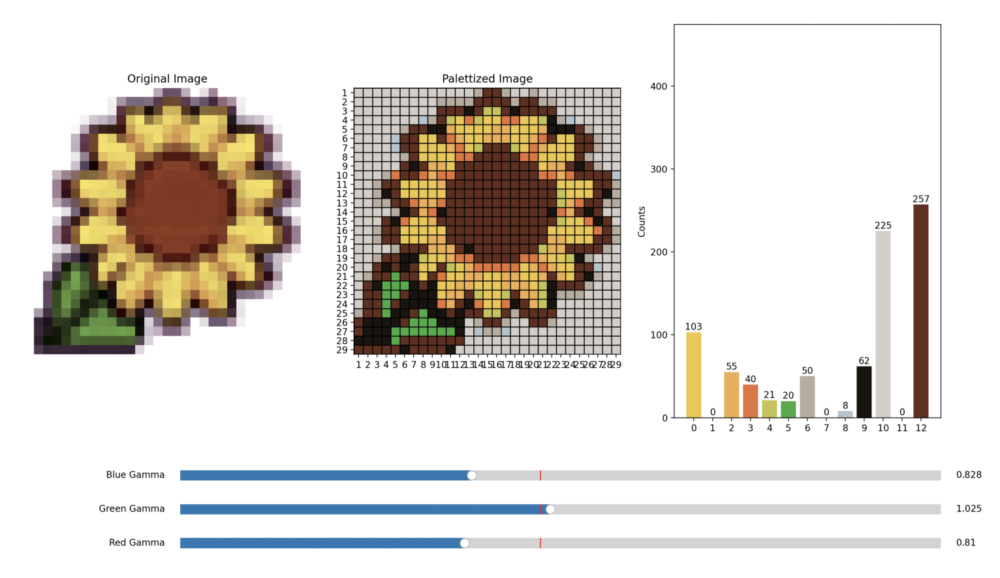

# bead-art

Perler bead color editor


Usage:

```
python main.py sunflower.png ikea.palette 29x29
```

Here the input image is downscaled to 29x29, and then ikea.palette is used to quantize the colors.

